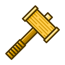
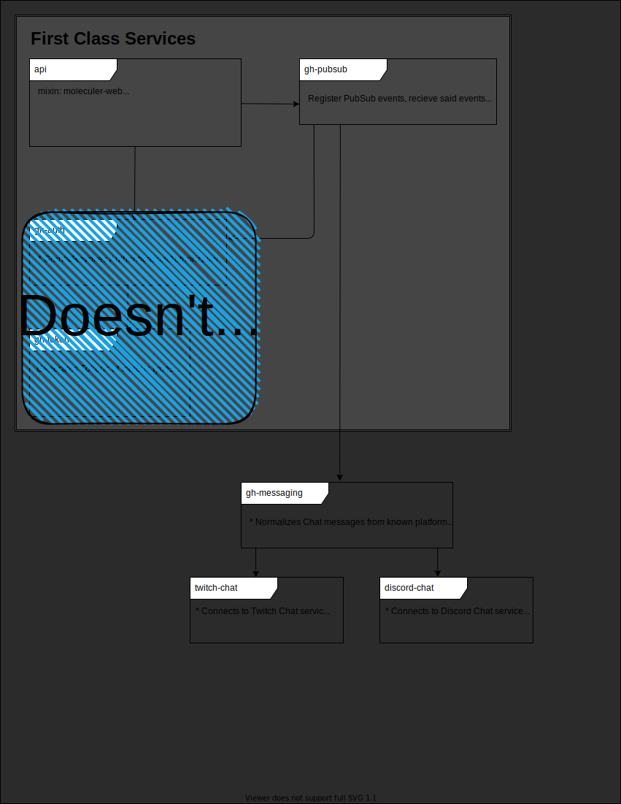

[](https://url.nfgarmy.com/discord)
[](https://twitch.tv/nfgCodex)

[](https://moleculer.services)
[](https://moleculer.services/docs/0.14/moleculer-web.html)
[](https://moleculer.services/docs/0.14/moleculer-io.html)

[](https://www.mongodb.com)
[](https://www.postgresql.org/)

[](https://www.redis.io)
[](https://www.nats.io)

[](https://www.docker.com)

# Project: Golden Hammer



This is a [Moleculer](https://moleculer.services/)-based microservices project. Generated with the [Moleculer CLI](https://moleculer.services/docs/0.14/moleculer-cli.html), and adapted to my own liking.

What exactly *IS* **Project: Golden Hammer**, you ask? Simply put, it's a scalable microservice architecture to aide in building applications driven by chat and platform-specific events from the likes of Twitch, Discord, YouTube, and more!

The over-arching goal is to normalize inputs from various platforms, and deliver them in a consistent, reliable manner that developers can then build their applications, extensions, and bots for a multitude of well-known platforms!

> At the time of this writing, we're using the phrase "Golden Hammer" in jest, while also admitting the reality that the multi-service and container nature of this project is entirely overkill for my personal use.
>
> The desire, however, is to open up a platform that developers can grow to depend on, and utilize in their own services, and thus scaling would be very important at that point.
>
> In the end, this is a fun project for me, and I will stream the entirety of building it on my Twitch channel until it's completed!
>
> http://twitch.tv/nfgCodex
> https://trello.com/b/YVw6e2yC/project-golden-hammer

## Usage

### Prerequisites

* Docker and Docker Compose
* Twitch App Registered
    * Twitch Client ID and Secret in Hand
* [TMI.js OAuth Password](https://twitchapps.com/tmi/)

### Environment Variables

| Variable Name        | Description                                                                                                                |
| -------------------- | -------------------------------------------------------------------------------------------------------------------------- |
| TMIJS_USER           | TMIJS Username                                                                                                             |
| TMIJS_PASSWORD       | [TMIJS Password](https://twitchapps.com/tmi/)                                                                              |
| TWITCH_CLIENT_ID     | Twitch OAuth App Client ID                                                                                                 |
| TWITCH_CLIENT_SECRET | Twitch OAuth App Client Secret                                                                                             |
| ---                  | -----                                                                                                                      |
| NAMESPACE            | Moleculerjs variable: [See Official Documentation](https://moleculer.services/docs/0.14/runner.html#Environment-variables) |
| LOGGER               | Moleculerjs variable: [See Official Documentation](https://moleculer.services/docs/0.14/runner.html#Environment-variables) |
| LOGLEVEL             | Moleculerjs variable: [See Official Documentation](https://moleculer.services/docs/0.14/runner.html#Environment-variables) |
| SERVICEDIR           | Moleculerjs variable: [See Official Documentation](https://moleculer.services/docs/0.14/runner.html#Environment-variables) |
| TRANSPORTER          | Moleculerjs variable: [See Official Documentation](https://moleculer.services/docs/0.14/runner.html#Environment-variables) |
| CACHER               | Moleculerjs variable: [See Official Documentation](https://moleculer.services/docs/0.14/runner.html#Environment-variables) |
| ---                  | -----                                                                                                                      |
| MONGO_URI            | TODO: Namespace mongo for service. IE, MONGO_URI_USERS                                                                     |

### Development Mode

The development phase of this project is meant to mimic that of the production environment, so all run-times are kept within Docker containers. To choose the runtime you expect to target, simply overlay the appropriate `docker-compose.*.yml` file over the base config to compliment and finalize the environment config.

Simply target the `dev` config to overlay the base:

```
docker-compose -f ./docker-compose.yml -f ./docker-compose.dev.yml up --build
```

This will also force a build of the images as needed, however the `command` for the `docker-compose.dev.yml` overlay instructs the image to run `npm run dev`. If you inspect the `package.json`, you'll see we are running `moleculer-runner` manually in order to also tack on the `--inspect` flag.

#### Debugging

Debugging can be pretty important in a crazy asynchronous and event-driven environment like a microservice structure, but it can also be pretty hectic considering there can be *tons* of containers.

##### Node Inspector

As mentioned above, we're tacking on the `--inspect` flag in development mode, so each container will start up with an inspector listening on `9229` internally. What you may already know, is we can't exactly forward that port to *every* container, so it's critical we select unique ports per container to forward to the internal/consistent `9229` port.

You can see the default `9229` port is relegated to the front HTTP API/Web/Socket server, but groups of microservices should be grouped into a relative range (i.e., "chat" services are in the `924x` range) to avoid collision and confusion.

##### VS Code

Along with starting all the microservices the cluster, you'll want to attach to said cluster for integration debugging. For this, we can rely on the `.vscode/launch.json` configurations, and more importantly the `compounds` and subsequent presentation groups to quickly launch multiple debugger connections at once!

##### `moleculer-repl`

Also included in development mode is the benevolent `moleculer-repl` that will let you drop into a shell-like interface and execute commands among your microservices.

Be sure to check out the [official documentation](https://moleculer.services/docs/0.12/moleculer-repl.html) to see what is fully capable, but connecting is simple:

```
docker attach golden-hammer_api_1
```

Note we're targeting `golden-hammer_api_1`, the API gateway, to attach our console. This will ensure our requests are coming from the API Gateway "host" (aka, container), and verify networking is crawling as we'd expect from the REST API service.

> To Detach, don't `CTRL+C` or you'll end up killing the service; instead, use the [default detach keystroke](https://docs.docker.com/engine/reference/commandline/attach/#extended-description): `CTRL-p, CTRL-q`.

### Production Mode

> FIXME: More exploration/details to come once we get to a production build and pipeline.

Simply target the `prod` config to overlay the base:

```
docker-compose -f ./docker-compose.yml -f ./docker-compose.prod.yml
```

## Infrastructure

### Microservice Layout/Access




### PubSub Flow - Chat


